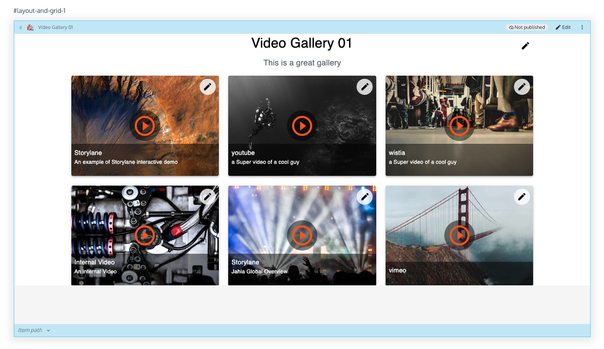

# React Video Gallery (Jahia V8.2 Module)

## Introduction

**React Video Gallery** is a **Jahia V8.2** module that provides full **React-based front-end rendering** with **GraphQL-powered data fetching**. It supports multiple video providers, including **YouTube, Vimeo, Wistia, Storylane**, and **internal Jahia video sources**.

This module integrates directly into **Jahia Edit Mode**, allowing content editors to update video configurations dynamically within the CMS.

---

## Table of Contents

- [Installation](#installation)
- [Building the Module](#building-the-module)
- [Deploying to Jahia](#deploying-to-jahia)
- [Usage](#usage)
- [Features](#features)
- [Jahia Integration](#jahia-integration)
- [Dependencies](#dependencies)
- [Configuration](#configuration)
- [GraphQL Queries](#graphql-queries)
- [Examples](#examples)
- [Troubleshooting](#troubleshooting)
- [Contributors](#contributors)
- [License](#license)

---
## Screenshots

---

## Installation

To set up the module in a **Jahia V8.2 environment**, follow these steps:

1. **Ensure Jahia V8.2 is installed and running**.
2. **Clone the repository**:

   ```sh
   git clone https://github.com/your-repo/react-video-gallery
   cd react-video-gallery
   ```

3. **Install dependencies**:

   ```sh
   npm install
   ```

---

## Building the Module

The module needs to be compiled and packaged into a `.jar` file before deployment.

### Steps to Build:

1. **Ensure you have Apache Maven installed**.
2. **Run the following command** from the project root:

   ```sh
   mvn clean install
   ```

3. This will generate a `.jar` file in the `target/` directory.

---

## Deploying to Jahia

After building the module, follow these steps to deploy it to Jahia:

1. **Open Jahia Module Manager**.
2. **Upload the generated JAR file** from `target/`.
3. **Start the module** inside Jahia.
4. **Enable the module on your Jahia site**.

Once deployed, you can start adding and configuring video components in Jahia.

---

## Usage

### Adding the React Video Gallery Component

After enabling the module, you can add the **React Video Gallery** component inside Jahia pages.

#### Example Jahia Component Usage:

```jsx
import React from 'react';
import ReactVideoGallery from './ReactVideoGallery';

const VideoGalleryPage = () => {
    return (
        <div>
            <h1>My Video Gallery</h1>
            <ReactVideoGallery />
        </div>
    );
};

export default VideoGalleryPage;
```

### Using the VideoService Component

This component handles embedding videos from multiple platforms.

```jsx
import VideoService from './VideoService';

<VideoService
    open={true}
    handleClose={() => console.log('Closed')}
    videoTitle="Sample Video"
    videoService="youtube"
    videoId="abc123"
/>
```

---

## Features

✅ Fully compatible with **Jahia V8.2**  
✅ Supports **YouTube, Vimeo, Wistia, Storylane**, and **internal Jahia video sources**  
✅ Uses **GraphQL (Apollo Client)** for dynamic content fetching  
✅ Seamless integration with **Jahia Edit Mode**  
✅ Fully responsive UI with **Material UI**  
✅ **React Player** for embedded video rendering  

---

## Jahia Integration

This module is designed specifically for **Jahia Digital Experience Platform (DXP) V8.2**, offering seamless integration with Jahia’s content repository.

- **Supports Jahia Edit Mode** for inline content editing.
- **Uses GraphQL (Apollo Client)** to fetch video data from Jahia’s JCR (Java Content Repository).
- **Dynamically configurable** using Jahia node properties.

### Jahia Node Configuration

| Property Name   | Type  | Description                        |
|----------------|-------|------------------------------------|
| `videoService` | String | Defines the video provider (YouTube, Vimeo, Wistia, etc.) |
| `videoId`      | String | The unique video ID for external providers |
| `videoUrl`     | String | URL for internally hosted videos |
| `videoDesc`    | String | A brief description of the video |
| `videoPoster`  | Image  | Thumbnail image for the video |

---

## Dependencies

To install required dependencies, run:

```sh
npm install @mui/material react-player @apollo/client i18next
```

This module relies on:

- **Jahia V8.2**
- **React**
- **@mui/material** (for UI components)
- **React Player** (for embedded video playback)
- **Apollo Client** (for GraphQL queries)
- **i18next** (for translations)

---

## Configuration

The component supports multiple video providers. Set the `videoService` property accordingly:

| Platform  | `videoService` Value | Additional Props |
|-----------|----------------------|------------------|
| YouTube   | `"youtube"`          | `videoId`       |
| Vimeo     | `"vimeo"`            | `videoId`       |
| Wistia    | `"wistia"`           | `videoId`       |
| Storylane | `"storylane"`        | `videoId`       |
| Internal  | `"internal"`         | `videoUrl`      |

---

## GraphQL Queries

The module fetches video data using **Apollo Client** and Jahia’s GraphQL API.

### Example Query:

```graphql
query getReactVideoGalleryData($workspace: Workspace!, $id: String!, $language: String!) {
    response: jcr(workspace: $workspace) {
        workspace
        Gallery: nodeById(uuid: $id) {
            title: displayName(language: $language)
            children {
                nodes {
                    ...InternalVideoFields
                    ...ExternalVideoFields
                }
            }
        }
    }
}
```

### Internal & External Video Fields

- **Internal Videos** are stored within Jahia and referenced via `videoUrl`.
- **External Videos** are embedded from platforms such as YouTube, Vimeo, and Wistia.

---

## Contributors

- **Stephane Monier** - Initial Development

---

## License

This project is **MIT Licensed**. See [`LICENSE`](LICENSE) for details.
